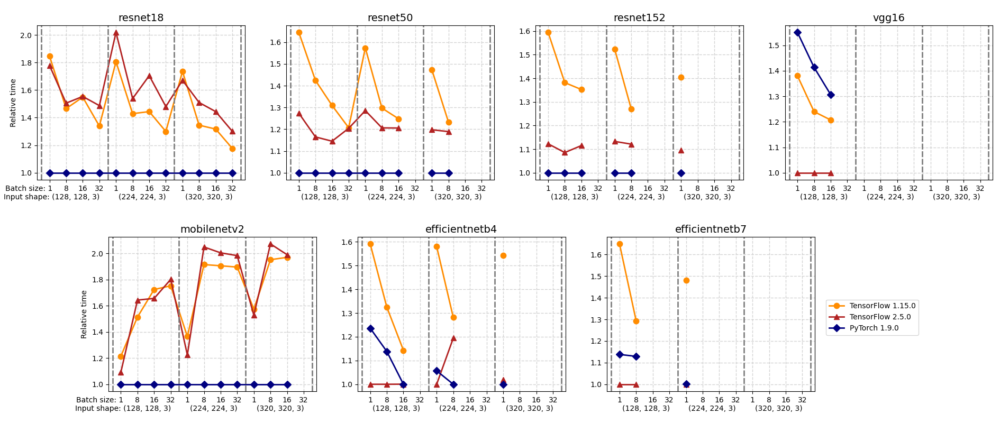
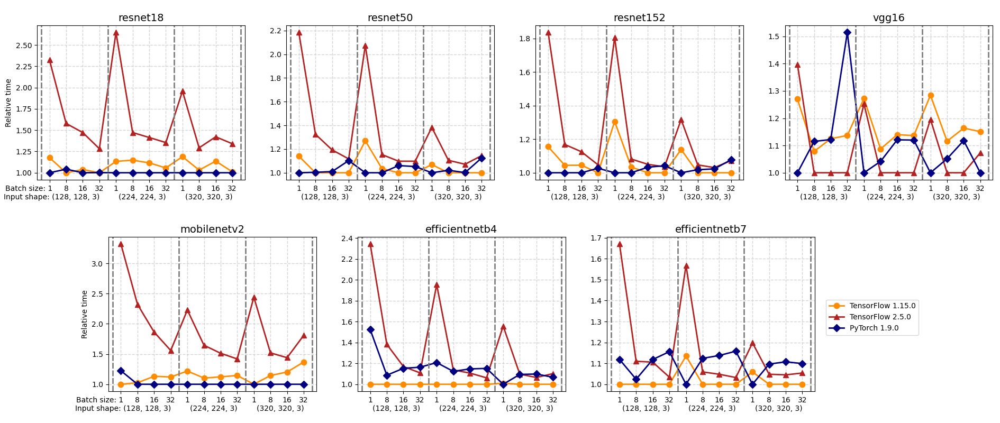
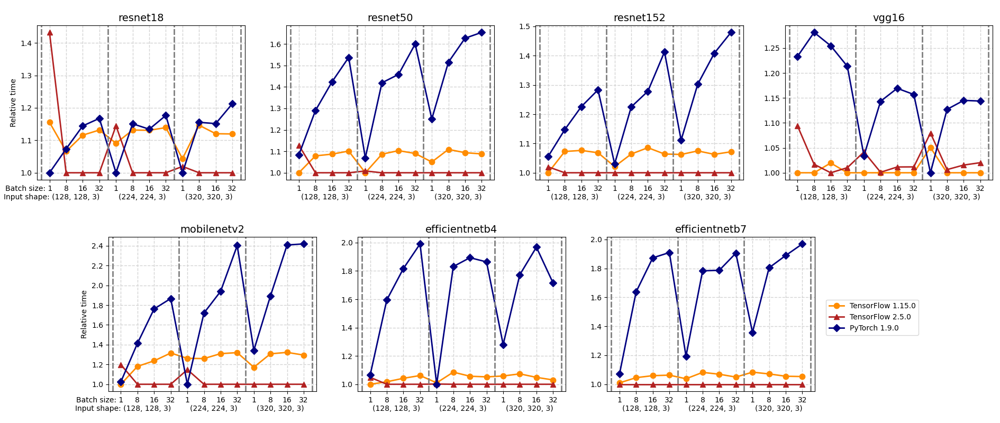
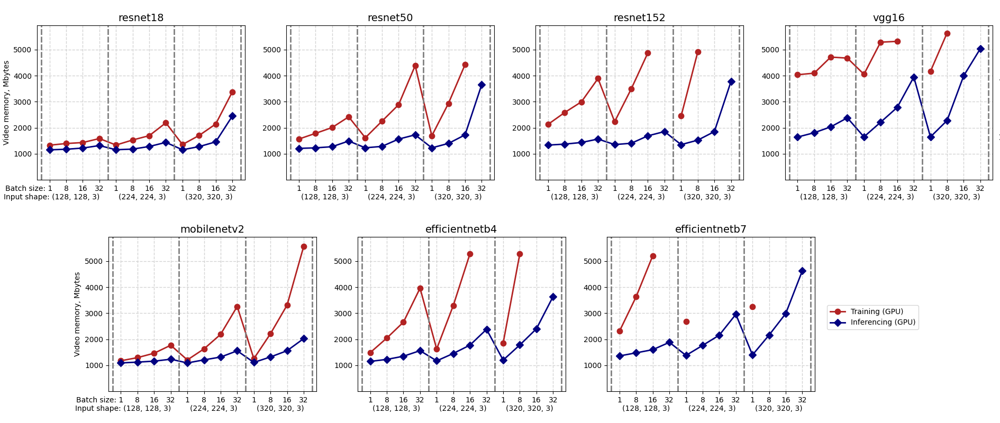

# TensorFlow and PyTorch performance benchmarking

This repository provides code to compare the performance of the following frameworks:
**TensorFlow 1.x**, **TensorFlow 2.x**, **PyTorch**.

To make performance benchmarking you need a PC with Nvidia GPU and installed nvidia drivers.

## 1. Prepare virtual environments

Use [conda](https://docs.conda.io/en/latest/miniconda.html) to prepare virtual environments
with CUDA toolkit.

#### TensorFlow 1.15.0

```shell
conda create --name tf1 python=3.7.10 -y
conda activate tf1
conda install cudatoolkit=10.0 -y
pip install -r requirements_tf_1x.txt
```

#### TensorFlow 2.5.0

```shell
conda create --name tf2 python=3.7.10 -y
conda activate tf2
conda install cudatoolkit=11.2 -c conda-forge -y
pip install -r requirements_tf_2x.txt
```

#### PyTorch 1.9.0

```shell
conda create --name torch python=3.7.10 -y
conda activate torch
conda install cudatoolkit=10.2 -y
pip install -r requirements_torch.txt
```

## 2. Specify benchmarking parameters

You can specify benchmarking parameters in [config.py](config.py):
* `RANDOM_SEED` - the random number generators are reinitialized in each process.
* `STEPS_NUMBER` - script will do `STEPS_NUMBER + 5` iterations in each process and use last `STEPS_NUMBER`
  iterations to calculate mean iteration time.
* `BENCHMARK_LOGS_PATH` - folder to save csv files with benchmarking results (will be created if not exists).
* `PLOTS_SAVE_PATH` - folder to save plots (used in `build_plots.py`, folder will be created if not exists).
* `TRAIN_LOGS_FILE_PATH`, `INFERENCE_GPU_LOGS_FILE_PATH`, `INFERENCE_CPU_LOGS_FILE_PATH` - 
  these csv files with benchmarking results will be created in `BENCHMARK_LOGS_PATH`.
* `GPU_NUMBER` - select any GPU for benchmarking.
* `ARCHITECTURES` - select any of the available convolutional neural networks for benchmarking.
* `INPUT_SIZES` - select any input image sizes (input image will have shape `(size, size, 3)`).
* `BATCH_SIZES` - select any batch sizes for training and inference steps.
* `MODES` - modes for testing, available modes: **'train'**, **'inference_gpu'**, **'inference_cpu'**.

Available now convolutional neural networks for benchmarking ([see in code](tf_torch_models/utils.py)):

```python
AVAILABLE_MODELS = [
    'efficientnetb0', 'efficientnetb1', 'efficientnetb2', 'efficientnetb3', 'efficientnetb4', 'efficientnetb5',
    'efficientnetb6', 'efficientnetb7', 'resnet18', 'resnet34', 'resnet50', 'resnet101', 'resnet152', 'vgg16', 'vgg19',
    'densenet121', 'densenet169', 'densenet201', 'inception_v3', 'mobilenetv2'
]
```

## 3. Run performance benchmarking

Before starting clean up previous results:

```shell
rm -rf benchmark_logs
```

Run sequentially for each of the frameworks:

#### TensorFlow 1.15.0
```shell
conda activate tf1
python main.py tf1
```
#### TensorFlow 2.5.0
```shell
conda activate tf2
python main.py tf2
```
#### PyTorch 1.9.0
```shell
conda activate torch
python main.py pytorch
```

Performance benchmarking results for training, inferencing using GPU and inferencing using CPU
will be in created `TRAIN_LOGS_FILE_PATH`, `INFERENCE_GPU_LOGS_FILE_PATH`, `INFERENCE_CPU_LOGS_FILE_PATH` respectively.

## 4. Current results

Current results obtained with:
* **GPU**: Nvidia GeForce RTX 2060;
* **CPU**: Intel(R) Core(TM) i7-9750H.

Check full performance benchmarking results in [benchmark_logs](benchmark_logs).
You can use `build_plots.py` to create plots, presented below:
```shell
python build_plots.py
```

#### The relative time of the training steps:



#### The relative time of the GPU inferencing steps:



#### The relative time of the CPU inferencing steps:



#### PyTorch 1.9.0 video memory:


